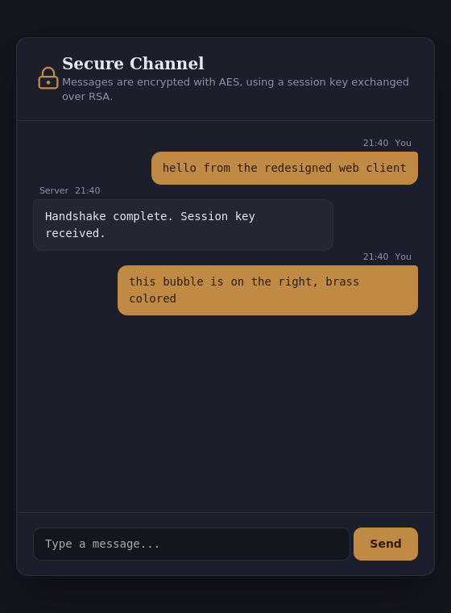

# GOMYCODE-cybersecPro-A-Practical-Journey-into-Secure-Computing
Phase 1:  Data Encryption: Implementing Data Encryption in a Secure Communication Channel.

## 1. Language / framework

- **Python 3**, with `pycryptodome` (the `Crypto` module) for encryption and
the standard `socket` module for networking.
- **html and css** for chat page styling
## 2. Secure communication channel design

**Hybrid RSA + AES** encryption — the same principle TLS/HTTPS uses:

```
Server                                  Client
------                                  ------
generates (pub_key, priv_key) RSA
  ── pub_key RSA ─────────────────►
                                         generates random AES session_key
                                         encrypts session_key with pub_key (RSA-OAEP)
  ◄──── encrypted session_key ─────
decrypts with priv_key RSA
   ⇒ both sides now share the same AES session_key

  ◄════ AES-EAX encrypted messages ════►   (both directions)
```

- **RSA** is used only once, to exchange the AES key securely (asymmetric
  encryption — slow, but no need to share a secret in advance).
- **AES-EAX** then encrypts every message (fast, suited to a continuous
  stream) — and **authenticates** each one: any message altered in
  transit fails to decrypt instead of silently corrupting.

Files:
```
config.py        shared settings (host, ports, secret key)
crypto_core.py      AES-EAX encrypt/decrypt — the shared engine
netutils.py          length-prefixed message framing over TCP
server.py            the chat server
client.py            terminal chat client
web_client.py         Flask web client (same handshake, browser UI is the intended target for a web vulnerability scan
                      (OWASP ZAP))
templates/chat.html   chat page
static/style.css      chat page styling
```

## 3. Getting started

### note: On recent Debian/Ubuntu, running `pip install pycryptodome` directly raises:

```
error: externally-managed-environment
× This environment is externally managed
```
- **A virtual environment** (`venv`) is the standard fix: an isolated Python + package set
for this project only, separate from the system Python. Once the venv is
active (prompt shows `(venv)`), both `pip install` and `python` (not just
`python3`) work normally inside it. Re-activate with
`source venv/bin/activate` each time a new terminal is opened.

```bash
sudo apt update && sudo apt install python3-venv
python3 -m venv venv
source venv/bin/activate
pip install pycryptodome
pip install -r requirements.txt
```

## 4. Running it

### Method 1:

**Terminal chat:**
1. Terminal 1: `python server.py`
2. Terminal 2: `python client.py`
3. Type messages on both sides and confirm they display correctly for
   the recipient.
   
### Method 2 (recommanded):

**Web chat:**
```bash
python server.py      # terminal 1
python web_client.py  # terminal 2
```
Then open `http://127.0.0.1:5000`.

##- 

**Validating the channel**:
- Capture the traffic with Wireshark, filter on `tcp.port == 5050`,
  and inspect the packet contents — it should be unreadable bytes, never
  the plaintext message.
- On WSL2, run the capture *inside* WSL (`sudo wireshark`), since any
  traffic never reaches a Windows-side network interface.
